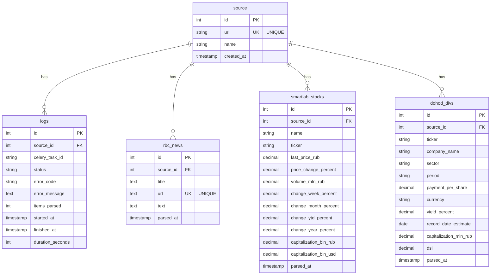

# Схема базы данных

## ER-диаграмма

## Описание таблиц

### source
Таблица источников данных (парсеров).

| Поле | Тип | Описание |
|------|-----|----------|
| id | SERIAL PRIMARY KEY | Уникальный идентификатор |
| url | VARCHAR(255) UNIQUE | URL источника данных |
| name | VARCHAR(100) | Название источника (RBC, SmartLab, Dohod) |
| created_at | TIMESTAMP | Дата создания записи |

**Индексы:**
- `url` - уникальный индекс

**Начальные данные:**
- `https://www.rbc.ru/quote` - RBC
- `https://smart-lab.ru/q/shares/` - SmartLab
- `https://www.dohod.ru/ik/analytics/share` - Dohod

### logs
Таблица логов выполнения парсеров.

| Поле | Тип | Описание |
|------|-----|----------|
| id | SERIAL PRIMARY KEY | Уникальный идентификатор |
| source_id | INT FK | Ссылка на источник |
| celery_task_id | VARCHAR(255) | ID задачи Celery |
| status | VARCHAR(20) | Статус выполнения (STARTED, SUCCESS, FAIL) |
| error_code | VARCHAR(50) | Код ошибки |
| error_message | TEXT | Сообщение об ошибке |
| items_parsed | INT | Количество обработанных записей |
| started_at | TIMESTAMP | Время начала выполнения |
| finished_at | TIMESTAMP | Время окончания выполнения |
| duration_seconds | INT | Длительность выполнения в секундах |

**Индексы:**
- `idx_logs_source_id` - индекс по source_id

### rbc_news
Таблица новостей с сайта РБК.

| Поле | Тип | Описание |
|------|-----|----------|
| id | SERIAL PRIMARY KEY | Уникальный идентификатор |
| source_id | INT FK | Ссылка на источник (RBC) |
| title | TEXT | Заголовок новости |
| url | TEXT UNIQUE | URL новости (уникальный) |
| text | TEXT | Полный текст новости |
| parsed_at | TIMESTAMP | Время парсинга |

**Индексы:**
- `idx_rbc_url` - индекс по url

### smartlab_stocks
Таблица данных об акциях с сайта SmartLab.

| Поле | Тип | Описание |
|------|-----|----------|
| id | SERIAL PRIMARY KEY | Уникальный идентификатор |
| source_id | INT FK | Ссылка на источник (SmartLab) |
| name | VARCHAR(255) | Название компании |
| ticker | VARCHAR(20) | Тикер акции |
| last_price_rub | DECIMAL(10,2) | Последняя цена в рублях |
| price_change_percent | DECIMAL(10,2) | Изменение цены в процентах |
| volume_mln_rub | DECIMAL(20,2) | Объем торгов в млн руб |
| change_week_percent | DECIMAL(10,2) | Изменение за неделю (%) |
| change_month_percent | DECIMAL(10,2) | Изменение за месяц (%) |
| change_ytd_percent | DECIMAL(10,2) | Изменение с начала года (%) |
| change_year_percent | DECIMAL(10,2) | Изменение за год (%) |
| capitalization_bln_rub | DECIMAL(20,2) | Капитализация в млрд руб |
| capitalization_bln_usd | DECIMAL(20,2) | Капитализация в млрд USD |
| parsed_at | TIMESTAMP | Время парсинга |

**Индексы:**
- `idx_smartlab_ticker` - индекс по ticker

### dohod_divs
Таблица данных о дивидендах с сайта Dohod.ru.

| Поле | Тип | Описание |
|------|-----|----------|
| id | SERIAL PRIMARY KEY | Уникальный идентификатор |
| source_id | INT FK | Ссылка на источник (Dohod) |
| ticker | VARCHAR(20) | Тикер акции |
| company_name | VARCHAR(255) | Название компании |
| sector | VARCHAR(100) | Сектор экономики |
| period | VARCHAR(100) | Период выплаты дивидендов |
| payment_per_share | DECIMAL(10,4) | Выплата на акцию |
| currency | VARCHAR(10) | Валюта (RUB, USD, EUR и т.д.) |
| yield_percent | DECIMAL(10,2) | Дивидендная доходность (%) |
| record_date_estimate | DATE | Оценочная дата закрытия реестра |
| capitalization_mln_rub | DECIMAL(20,2) | Капитализация в млн руб |
| dsi | DECIMAL(10,2) | Индекс DSI |
| parsed_at | TIMESTAMP | Время парсинга |

**Индексы:**
- `idx_dohod_ticker` - индекс по ticker

## Связи между таблицами

- `source` → `logs` (один ко многим)
- `source` → `rbc_news` (один ко многим)
- `source` → `smartlab_stocks` (один ко многим)
- `source` → `dohod_divs` (один ко многим)

Все таблицы данных связаны с таблицей `source` через внешний ключ `source_id`.

## Технологии

- **База данных:** PostgreSQL 15
- **ORM:** SQLAlchemy 2.0+
- **Асинхронный драйвер:** asyncpg
- **Синхронный драйвер:** pg8000 (для Celery задач)

## Миграции

Схема БД создается автоматически при первом запуске через файл `src/database/init.sql`.

SQLAlchemy модели определены в `src/database/models.py` и могут использоваться для создания миграций через Alembic (при необходимости).

