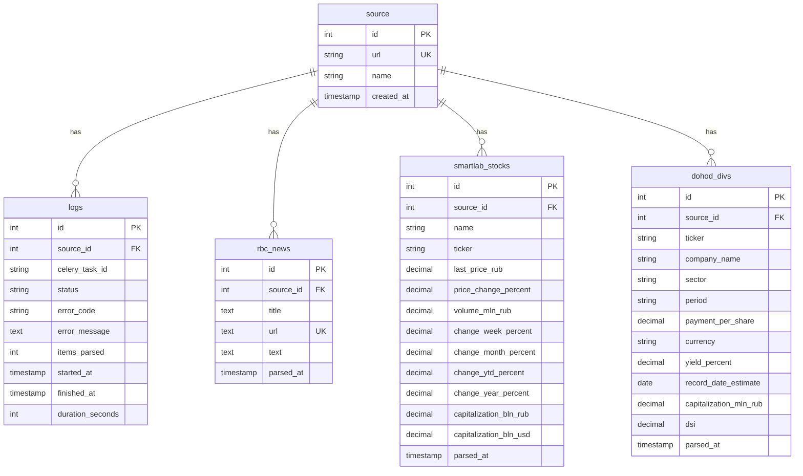

# ER Диаграмма базы данных

## Описание схемы базы данных

База данных состоит из 5 основных таблиц, связанных через внешние ключи.

## ER Диаграмма (текстовое представление)

```
┌─────────────────┐
│     source      │
├─────────────────┤
│ id (PK)         │◄─────┐
│ url (UNIQUE)    │      │
│ name            │      │
│ created_at      │      │
└─────────────────┘      │
                          │
         ┌────────────────┼────────────────┐
         │                │                │
         │                │                │
┌────────▼────────┐ ┌─────▼──────┐ ┌──────▼──────────┐
│      logs       │ │ rbc_news   │ │ smartlab_stocks │
├─────────────────┤ ├────────────┤ ├─────────────────┤
│ id (PK)         │ │ id (PK)    │ │ id (PK)         │
│ source_id (FK)  │─┤ source_id  │─┤ source_id (FK)  │─┐
│ celery_task_id  │ │ (FK)       │ │                 │ │
│ status          │ │ title      │ │ name            │ │
│ error_code      │ │ url        │ │ ticker          │ │
│ error_message   │ │ (UNIQUE)   │ │ last_price_rub  │ │
│ items_parsed    │ │ text       │ │ price_change_%  │ │
│ started_at      │ │ parsed_at  │ │ volume_mln_rub  │ │
│ finished_at     │ └────────────┘ │ change_week_%   │ │
│ duration_seconds│                │ change_month_%  │ │
└─────────────────┘                │ change_ytd_%    │ │
                                   │ change_year_%   │ │
┌─────────────────┐                │ cap_bln_rub     │ │
│  dohod_divs     │                │ cap_bln_usd     │ │
├─────────────────┤                │ parsed_at       │ │
│ id (PK)         │                └─────────────────┘ │
│ source_id (FK)  │─┐                                 │
│ ticker          │ │                                 │
│ company_name    │ │                                 │
│ sector          │ │                                 │
│ period          │ │                                 │
│ payment_per_share│                                 │
│ currency        │ │                                 │
│ yield_percent   │ │                                 │
│ record_date_est │ │                                 │
│ capitalization  │ │                                 │
│ dsi             │ │                                 │
│ parsed_at       │ │                                 │
└─────────────────┘ │                                 │
                    │                                 │
                    └─────────────────────────────────┘
                          Все таблицы ссылаются на source
```

## Описание таблиц

### 1. `source` (Источники данных)
- **Назначение**: Хранит информацию об источниках данных (RBC, SmartLab, Dohod)
- **Поля**:
  - `id` (SERIAL PRIMARY KEY) - Уникальный идентификатор
  - `url` (VARCHAR(255) UNIQUE) - URL источника
  - `name` (VARCHAR(100)) - Название источника
  - `created_at` (TIMESTAMP) - Дата создания записи

### 2. `logs` (Логи парсинга)
- **Назначение**: Хранит логи выполнения задач парсинга
- **Поля**:
  - `id` (SERIAL PRIMARY KEY) - Уникальный идентификатор
  - `source_id` (INT, FK → source.id) - Ссылка на источник
  - `celery_task_id` (VARCHAR(255)) - ID задачи Celery
  - `status` (VARCHAR(20)) - Статус выполнения (STARTED, SUCCESS, FAIL)
  - `error_code` (VARCHAR(50)) - Код ошибки (если есть)
  - `error_message` (TEXT) - Сообщение об ошибке
  - `items_parsed` (INT) - Количество обработанных элементов
  - `started_at` (TIMESTAMP) - Время начала
  - `finished_at` (TIMESTAMP) - Время завершения
  - `duration_seconds` (INT) - Длительность в секундах

### 3. `rbc_news` (Новости RBC)
- **Назначение**: Хранит новости с сайта РБК
- **Поля**:
  - `id` (SERIAL PRIMARY KEY) - Уникальный идентификатор
  - `source_id` (INT, FK → source.id) - Ссылка на источник
  - `title` (TEXT) - Заголовок новости
  - `url` (TEXT UNIQUE) - URL новости (уникальный)
  - `text` (TEXT) - Текст новости
  - `parsed_at` (TIMESTAMP) - Время парсинга

### 4. `smartlab_stocks` (Акции SmartLab)
- **Назначение**: Хранит данные об акциях с сайта SmartLab
- **Поля**:
  - `id` (SERIAL PRIMARY KEY) - Уникальный идентификатор
  - `source_id` (INT, FK → source.id) - Ссылка на источник
  - `name` (VARCHAR(255)) - Название компании
  - `ticker` (VARCHAR(20)) - Тикер акции
  - `last_price_rub` (DECIMAL(10, 2)) - Последняя цена в рублях
  - `price_change_percent` (DECIMAL(10, 2)) - Изменение цены в %
  - `volume_mln_rub` (DECIMAL(20, 2)) - Объём в млн руб
  - `change_week_percent` (DECIMAL(10, 2)) - Изменение за неделю
  - `change_month_percent` (DECIMAL(10, 2)) - Изменение за месяц
  - `change_ytd_percent` (DECIMAL(10, 2)) - Изменение с начала года
  - `change_year_percent` (DECIMAL(10, 2)) - Изменение за год
  - `capitalization_bln_rub` (DECIMAL(20, 2)) - Капитализация в млрд руб
  - `capitalization_bln_usd` (DECIMAL(20, 2)) - Капитализация в млрд USD
  - `parsed_at` (TIMESTAMP) - Время парсинга

### 5. `dohod_divs` (Дивиденды Dohod)
- **Назначение**: Хранит данные о дивидендах с сайта Dohod.ru
- **Поля**:
  - `id` (SERIAL PRIMARY KEY) - Уникальный идентификатор
  - `source_id` (INT, FK → source.id) - Ссылка на источник
  - `ticker` (VARCHAR(20)) - Тикер акции
  - `company_name` (VARCHAR(255)) - Название компании
  - `sector` (VARCHAR(100)) - Сектор экономики
  - `period` (VARCHAR(100)) - Период дивидендов
  - `payment_per_share` (DECIMAL(10, 4)) - Выплата на акцию
  - `currency` (VARCHAR(10)) - Валюта
  - `yield_percent` (DECIMAL(10, 2)) - Доходность в %
  - `record_date_estimate` (DATE) - Оценочная дата закрытия реестра
  - `capitalization_mln_rub` (DECIMAL(20, 2)) - Капитализация в млн руб
  - `dsi` (DECIMAL(10, 2)) - Индекс DSI
  - `parsed_at` (TIMESTAMP) - Время парсинга

## Индексы

Для оптимизации запросов созданы следующие индексы:
- `idx_logs_source_id` - на `logs.source_id`
- `idx_dohod_ticker` - на `dohod_divs.ticker`
- `idx_rbc_url` - на `rbc_news.url`
- `idx_smartlab_ticker` - на `smartlab_stocks.ticker`

## Связи

- **source → logs**: Один ко многим (один источник может иметь много логов)
- **source → rbc_news**: Один ко многим
- **source → smartlab_stocks**: Один ко многим
- **source → dohod_divs**: Один ко многим

## Диаграмма в формате Mermaid (для GitHub)



